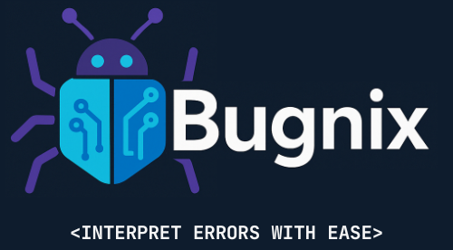

<p align="center">
  
</p>

# 📃 Contents:
-  [💡 Overview](https://github.com/DatDevSteve/bugnix?tab=readme-ov-file#-overview)
-  [🛠 Tech Stack](https://github.com/DatDevSteve/bugnix?tab=readme-ov-file#-tech-stack)
-  [📥 Setting Up a Local Instance](https://github.com/DatDevSteve/bugnix?tab=readme-ov-file#-setting-up-a-local-instance)
-  [🖇 How it works?](https://github.com/DatDevSteve/bugnix?tab=readme-ov-file#-how-it-works)
-  [🧩 Known Issues](https://github.com/DatDevSteve/bugnix?tab=readme-ov-file#-known-issues)
-  [🧭 Bugnix Roadmap](https://github.com/DatDevSteve/bugnix?tab=readme-ov-file#-bugnix-roadmap)
-  [⭐ Credits](https://github.com/DatDevSteve/bugnix?tab=readme-ov-file#-credits)

<br>
<br>

# 💡 <b>Overview</b>
### Check out the app here: <https://bugnix.streamlit.app>
#### Bugnix is a powerful and efficient generative A.I. based code error analyzer and interpretor to make code debugging simpler

#### Powered by [Microsoft's Azure AI](https://azure.microsoft.com/en-in/solutions/ai/), Bugnix is made under specific consideration of beginner level programmers, who find programming jargon an overwhelming experience, as well as for all the other programmers who find code debugging a tedious process.

#### Trained on code errors from famous programming languages, Bugnix analyses the error fed by the user, and provides a simple explaination of the error.
<br>
<br>

# 🛠 <b>Tech Stack</b>
### ⚙ <u>APIs Used:</u>
-  👁 [Azure AI Vision](https://azure.microsoft.com/en-us/products/ai-services/ai-vision):<br> For extracting text from image snapshots of code error. 
-  🧠 [Azure OpenAI](https://azure.microsoft.com/en-us/products/ai-services/openai-service): <br> LLM for processing the error and generating an explaination with solution. Uses GPT o3 mini as the model for processing.
-  🔄 [Stack Exchange API](https://api.stackexchange.com/) (not implemented yet): <br> Refined error analysis and code grounding by integrating information from a flagship question-and-answer website for programmers.  

### ⚙ <u>Frontend:</u>
- 💻 [Streamlit:](https://streamlit.io/) <br> Open Source Python Web Application Framework especially designed to deploy Generative A.I. based web applications.

### <u>Additional Tools:</u>
- 🔑 [Python Dotenv](https://github.com/theskumar/python-dotenv) <br> Python Library to ready key-value pairs and set them as environment variables. Essential for storing API Keys.
<br>
<br>

# 📥 <b>Setting Up a Local Instance</b>
### 💿 <u>Requirements:</u>
-  Python (version 3.10+): To execute and run the app
-  Any operating system (Windows, MacOS, Linux)

### ✅ <u>Set up a virtual environment:</u>
-  As a good programming practice, it is recommended to set up a Python virtual environment to run Bugnix in order to avoid potential build errors or conflicts while installing packages

### 🔗 <u>Clone the Repository:</u>
 Assuming that you already have setup your virtual environment,
```bash 
> git clone https://github.com/datdevsteve/bugnix.git
> cd bugnix
```
 ➡ <u>Install the required packages:</u>
```bash
> pip install -r requirements.txt
```
 Or install all the packages manually:
```bash
> pip install openai azure-functions py-stackexchange azure-ai-vision-imageanalysis==1.0.0b1 azure-identity azure-core streamlit requests beautifulsoup4 html5lib python-dotenv
```
### 🔐 <u>Setup environment keys</u>
-  Create a file named <code>.env</code> in the project directory
-  Setup the <code>.env</code> file's content as below:
``` bash
AZURE_OCR_ENDPOINT = "https://yourocrendpoint.azure.com/"
AZURE_OCR_KEY = yourazurekey
AZURE_OPENAI_ENDPOINT = "https://youropenaiendpoint.azure.com/"
AZURE_OPENAI_KEY = yourazurekey
STACKOVERFLOW_API_KEY= yourstackoverflowkey
```
<br>
<br> 

# 🖇 How it works?
 ➡ You upload a screenshot of your error or paste the error text and click <code>⏩ Analyze Error</code> Button 
 ➡ You can also try using a random test error by clicking on <code>❔ Try a Test Error</code> Button
 ➡ Bugnix will do it's magic by:
-  Extracting the error text from the image using [OCR](https://azure.microsoft.com/en-us/products/ai-services/ai-vision) or grab the pasted error text.
-  Feed it into the [LLM](https://azure.microsoft.com/en-us/products/ai-services/openai-service), generate interpretation of the error with solution.
-  Ground it with [Stack Exchange API](https://api.stackexchange.com/).
-  Return the generated output on your screen.
<br>
<br>


# 🧩 Known Issues:
-  OCR not functioning and extracting text due to poor quality screenshot.
-  The LLM may sometimes need additional context to provide better analysis of the error. You may share additional information accordingly.

<br>
<br> 

# 🧭 Bugnix Roadmap:
  ✅ OCR and LLM Integration.<br>
  ✅ Stack Overflow Codebase Grounding.<br>
  ⬜ Support for User Accounts to save error interpretations.<br>
  ⬜ Better Performance<br>

<br>
<br> 

# ⭐ Credits:
### **Designed & Developed by**: Rehaan Tamboli [(DatDevSteve)](https://github.com/DatDevSteve)
### Inspired by the need for smarter debugging tools.